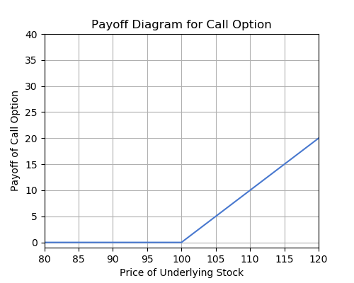
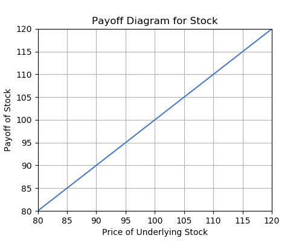

# Finance

This week, we will be covering some of the greatest hits of Financial Economics - most of which you can learn by taking Econ 136. We will begin our discussion with an important introduction to interest rates and the time value of money. After, we will pivot to stock options. These are ways investors can bet on stock value movements through purchasing or selling contracts that only have value at certain stock prices.

## Present Value, Future Value and Interest Rates

### The Time Value of Money

An important concept that is the basis for most of finance is the *time value of money*: money now is worth more than money in the future. This makes sense; you would rather have \\$100 now than later. But what if I owed you money and I really wanted to postpone the payment? In order to compensate you for your bias toward having money as soon as possible, I would need to pay more than I owed. Otherwise, you might not tolerate a delayed payment. This idea of an extra payment to address time concerns is called *interest*. There is also a dimension of risk as well. If you had reason to doubt my ability to repay you in the future, you might charge me more interest to compensate for this risk.

### Interest

Interest is at the heart of loans, fixed income securities, and financial economics in general. We are familiar with the bank account: you give a certain amount of money to a financial institution, and they compensate you for allowing them to use your money to invest in other assets. What they pay you for keeping your money is interest, and is normally quantified as a percentage of what you deposit with them - an interest rate. Thus, for each \\$1 deposited at the bank, you will receive $r$ dollars in interest, where $r$ is the interest rate quoted by the bank. Note that $r$ takes the form of a decimal value: 0.05, for instance, and not 5\%.

Interest can be paid out in different time intervals - usually monthly, quarterly, yearly or continuously. Also, if you earn some interest in one year, in the next year you will not only earn interest on the initial amount you deposited, but also on the amount you earned the year before. This reflects the idea of *compounding interest*. We are able to determine how much \\$1 will be worth in $t$ years, when compounding n times per year at an interest rate of r.

$$
\text{Value of \\$1 in $t$ years} = \\$1 \times \left(1 + \dfrac{r}{n} \right) \times \left(1 + \dfrac{r}{n} \right) \times \cdots \times \left(1 + \dfrac{r}{n} \right) \\
= \\$1 \left(1 + \dfrac{r}{n} \right)^{nt}
$$

Take a look at the table below for an example of the effects of compounding.

|-| Bank 1: 5\% annual compounding | Bank 2: 5\% semi-annual compounding |
| --- | --- | --- |
| January 2016 | $\$100$ | $\$100$ |
| July 2016    |  -   | $\$100 \left(1 + \dfrac{0.05}{2} \right) = \\$102.50$ |
| January 2017 | $\$100 (1 + 0.05) = \\$105$ | $\$102.50 \left(1+\dfrac{0.05}{2} \right) = \\$105.0625$ |
| July 2017    |  -   | $\$105.0625 \left(1 + \dfrac{0.05}{2} \right) = \\$107.69$ |
| January 2018 | $\$105 (1 + 0.05) = \\$110.25$ | $\$107.69 \left(1 + \dfrac{0.05}{2} \right) = \\$110.38$   |
| Total Percent Change | 10.25\%               | 10.38\%                        |

Notice that instead of a 5\% x 2 = 10\% increase, you end up receiving a 10.25\% or 10.38\% increase depending on the rate of compounding. This is because the interest you received in the first compounding period (in bank 1’s case, a year, in bank 2’s case, half a year) is added onto your initial deposit, and this new deposit is used for calculating interest in the next period. Thus, even a small amount of money can grow quickly under interest rate compounding.

### Present Value, Future Value, and Discount Factor

An important related concept is the idea of present and future value. We have already discussed future value above. A \\$100 deposit at bank 1 above has a future value of \\$110.25 after 2 years. Conversely, an important question frequently asked in finance is the following: Given an amount of money in the future, what is its fair value today? In this example, what is the present value of \\$110.25 at bank 1, 2 years in the future? Well, from the table above, \\$100! This idea of present value is essential to the pricing of assets. In general, an asset's price is the present value of all expected future payments.

$$
\text{FV of \\$1} = \\$1 \times \left(1 + \dfrac{r}{n} \right)^{nt}
$$

$$
\text{PV of \\$1} = \dfrac{\$1}{\left(1 + \dfrac{r}{n} \right)^{nt}}
$$

We call $\frac{1}{(1 + r/n)^{nt}}$ a *discount factor*. It discounts the value of \\$1 from the future into today. This ties in with the time value of money. Since a dollar today is worth more than a dollar tomorrow, in order for you to be indifferent between receiving money today or tomorrow, the money you would receive tomorrow has to be discounted into the present by some amount that depends on the interest rate.

## Options: Calls, Puts

### Basics

Before we discuss options, it's important to understand some basics regarding stocks. A stock is a share in a company. By owning stock you are owning a small part of a company. Stocks trade on a stock exchange, where people come together to buy and sell shares to one another. People who want to buy a stock place a *bid*, or a price at which they want to buy. Others who want to sell place an *ask*, or a price that they want to sell. The market price of a stock is where these bids and asks come together.

If I purchase and hold onto a stock, I am said to have a *long* position on the stock. If the stock goes up in value, I profit. If it goes down in value, I lose. It is also possible to have inverse exposure to the price of a stock, meaning that if the price of the stock goes down I profit, and if it goes up I lose. This is called shorting the stock, or having a *short* position on the stock. This is accomplished by borrowing stock from a stock broker and selling it today, and then buying it back sometime in the future to pay off your "loan" of borrowed stock from the broker. 

You can see how you can profit from this if you sell stock at \\$100. Then, if the value of the stock goes down to \\$70 in the future, you can buy back the stock using the \\$100 you made earlier, thus finishing your loan from the broker. However, you have \\$30 left over. You made \\$100 selling the stock, yet it only cost \\$70 to buy it back. Thus, you have made a profit from the stock going down in value.

Recall that in a short position, you never actually owned the stock to begin with. You borrowed the stock from a stock broker, and you paid back that stock in the future. In reality, the stock broker wants to be paid for the service it provides you, and someone shorting stock will have to effectively pay interest on that "loan", just like a normal loan.

### Puts

Suppose you own some stock in an investment account. You want your stock to be able to increase in value over time, but you also don't want its value to decrease too much. One way to think about this is that you want to own some asset that has asymmetrical payoff; you want all the potential upside of owning the asset with as little of the downside as possible.

One way to achieve this is to buy "insurance" on your stock. You might want an insurance contract that will cover losses if the value of your stock goes below a certain number. This type of contract exists, and they are called *puts*.

The simplest way to think about a put is that it is a contract that pays you a dollar for each dollar that your stock does below some specified number. So for instance, if you own a stock that trades at \\$110, and you don't want to lose more than \\$10 in value from owning the stock, you might buy a put with a *strike* of \\$100. The strike of the put is this pre-specified number below which you don't want to lose money. Now, let's say your stock starts going down in value. Going down from \\$110 to \\$100, there's nothing that your put can do. But starting at \\$100, each dollar that your stock goes down in value, your put pays you one dollar. Therefore, when you own this put *in combination* with the stock, the overall value of this combination cannot go below \\$100.

Let's call this combination of stock and put a *portfolio*. Your portfolio's value depends on the value of the stock, and the portfolio's value looks like this:

Now that we have the basic intuition down, let's get more specific. While a put behaves like insurance, the way a put is technically defined is a bit different. A put contract says the following:

>"The holder of this contract has the right, *but not the obligation*, to sell 100 shares of an underlying stock at a specified strike price, from now until some expiration date."

You can see how this behaves essentially as insurance. If the strike price is \\$100 as above, and your stock goes below \\$100 in value, you might want to exercise your right to sell your shares at \\$100. Regardless of how far below \\$100 your stock is, the put allows you to sell at \\$100. Additionally, if your stock is valued above \\$100, there's no reason to exercise your right to sell at \\$100; you could just sell at whatever price your stock is trading.

### Calls

The opposite of a put, in a sense, is a *call*. A call contract specifies the following:

>"The holder of this contract has the right, *but not the obligation*, to buy 100 shares of an underlying stock at a specified strike price, from now until some expiration date."

You could technically interpret calls as insurance for people who are *short* some stock, but this isn't the most helpful way to think about them. A better way to think about calls is the following: Suppose you want to buy and hold a stock, but you aren't sure if the value of the stock will go up in a desired time frame. Instead of buying the stock and risking that its value will decrease, you could buy a call that gives you the *opportunity* to purchase the stock at some price that you want, say \\$100. That way, if the value of the stock goes above \\$100, instead of missing out on that increase in value, your call gives you the right to purchase the stock at \\$100, even though it is actually worth more than \\$100. If the stock is worth less than \\$100 after some time, you don't have to do anything and you didn't lose the value you would have lost if you had purchased the stock.

### Payoff Diagrams

Instead of thinking about the value of a portfolio with a stock and a put, let's just think about the value of a put given the price of the underlying stock. In other words, you don't actually own the stock, you just own the put. Let's use the example of a put with a strike of \\$100 as above. If the stock is trading somewhere below \\$100, say \\$90, then the put has a payoff of \\$10. The reason for this is because you could purchase the stock for \\$90, and then use your put, which gives you the right to sell a stock for \\$100. That's a profit of \\$10, and therefore the put has a payoff of \\$10.

Similarly, if the stock is trading above \\$100, the put has no payoff. If you were to buy the stock at its price and use your put to sell at \\$100, you would lose money. This is because it cost you more than \\$100 to buy the stock, but you only sold for \\$100. Since you are never actually obligated to use a put, you would not use it in this case, and it has 0 payoff.

**Notice that all of this occured without you ever owning the stock to begin with.**

Now let's plot the payoff of this put with a strike of \\$100, given the price of the underlying stock.

The payoff of a call works similarly. Remember that a call gives you the right to buy a stock at a certain price. So if you own a call with a strike of \\$100, and the underlying stock is trading at \\$110, the call has a payoff of \\$10. This is because you could use your call to buy the stock for \\$100, and then sell it for \\$110, since this is the market price of the stock. And again, if the stock is trading below \\$100 the call has no payoff. This is because if you were to use your call to purchase the stock at \\$100, you could only sell it for less than \\$100, thus losing money. A rational investor would never use the call for this, and therefore it has no payoff. Below is the payoff diagram for a call with a strike of \\$100.

And quickly, here are the payoff diagrams for being long and short a stock, which should appear trivial by now. These diagrams ignore the price of the stock when you bought/shorted it. In other words, if you purchased the stock at \\$100, and sold at \\$100, the diagram implies a payoff of \\$100. This is to be consistent with the above diagrams, in which we implicitly assumed that there is no cost in buying an option, a claim which we will examine below.

Now, we see how we can generate the payoff diagram for the portfolio of a stock and a put from above. The diagram for that portfolio is copied below.

Notice how we can generate this by adding the payoff diagrams of a stock and a put. We have shown that the payoff diagram of a portfolio can be represented as the sum of payoff diagrams of its components.

### Pricing Options

We have only been studying one side of an option contract: the holder of the option. Of course, in order to own a contract that gives you the right to buy or sell a stock at a certain price, someone has to be willing to guarantee you that right. Offering you that right comes with some risk, because whoever sells you the contract might be obligated to buy or sell a stock from you at a price that is not favorable. Because of this, they will ask for payment in return. Therefore, just like any other form of insurance, options are not free.

Let's think about what could contribute to an option's price. We know that someone is taking on risk by selling you an option, so whatever puts that person at an increased risk of losing money should make the option more expensive. For this lesson let's only think about the price of a call.

* **Strike price**. Suppose a stock is trading at \\$100, and I am interested in a call with a strike of \\$110. The person who sells me that call bears some risk, because the price of the stock might go above \\$110 sometime in the future, in which case I would profit and the person who sold me the option would lose money. Now suppose I look at a call with a strike of \\$120. The person selling me the \\$120 call bears some risk, but not as much as the first person, because it is less likely that the stock's price exceeds \\$120 sometime in the future compared to the chance that it exceeds \\$110. So which of these two options should cost more, holding all else equal? Naturally, the call with the strike of \\$110 should cost more, because it is more likely that I make money with this call as opposed to the \\$120 call, and therefore more likely that the person selling it to me loses money. **This shows that for calls, the lower the strike price, the more expensive the call becomes**.
* **Time until expiration**. We briefly mentioned earlier in the definitions for calls and puts that options are only active for a certain time period. So if a call is only active for 1 week, while an otherwise identical call is active for 1 year, which should cost more? Using similar logic as above, the call lasting 1 year puts the option seller at a higher risk of losing money, since there is more time for the underlying stock price to move in such a way that is disadvantageous. The call lasting 1 week doesn't have much time at all to move in such a way that the option seller loses money. **This shows that for calls, the farther away the expiration, the more expensive the call becomes**.
* **Volatility**. Imagine a stock is trading at \\$100, and historically this stock's price does not move very much at all. Now, imagine another stock that is also trading at \\$100, but has a history of wild price swings. In this example, if there exist two calls with otherwise identical attributes on these two stocks, which one should cost more? We say that the stock with a history of price swings is more volatile than the more tame stock. The more volatile stock has a higher chance of jumping up in price to a point where you can make a profit compared to the more tame stock. **This shows that for calls, the higher the volatility of the underlying stock, the more expensive the call becomes**.
* **Underlying stock price**. This should be the most obvious factor that affects the prices of options. If someone is offering to sell a call with a strike of \\$100 on some stock, and the stock's price is \\$90, then the call option will have some price. But if the stock jumps in value to \\$95, then clearly the call option will be worth more. After the stock's price increases to \\$95, it becomes more likely that the stock' price can exceed \\$100 sometime in the future. This exposes the person selling you the call to a higher risk of losing money, and therefore the person will charge more for the call. **This shows that for calls, the higher the price of the underlying stock, the more expensive the call becomes**.
* **The risk-free interest rate**. This one is a bit less intuitive and we will not be discussing this in depth, but the prevailing interest rate of risk-free deposits also affects the prices of options.

#### Black-Scholes

So how would we calculate the fair price of an option? Intuitively, the fair price of an option should be the payoff of the option for every possible price of the stock, weighted by the probability of that stock being at that particular price, discounted into the present (since you receive some payment in the future). It turns out that this is a pretty complicated problem to solve, and we will not ask you derive the following formulae. Below is an expression for the price of a call and a put.

$$C = S \cdot N(d_1) - K \cdot e^{-r_{rf}T} \cdot N(d_2)$$
$$P = K \cdot e^{-r_{rf}T} \cdot N(-d_2) - S \cdot N(-d_1)$$

where $S = $ the price of the stock, $K = $ the strike of the call, $r_{rf} = $ the risk-free interest rate, $T = $ time till expiration, $N() = $ the normal CDF, $d_1 = \frac{ln(S/K) - (r_{rf} + \sigma^2/2)T}{\sigma\sqrt{T}}$, and $d_2 = d_1 - \sigma\sqrt{T}$.

**Disclaimer:** These expressions are actually the prices for something called *European options*. A European option is an option that only allows you to exercise (use the option) exactly on the expiration date, and not before. The definitions for options that we gave earlier correspond to something called *American options*, which allow you to exercise the option at any time, even before expiration. The reason we have the prices for European options and not American options is because the prices for American options are actually even more difficult to find. For example, American puts are priced quite differently from European puts. However, for a stock that does not pay dividends, the prices for American calls and European calls tend to be similar.

### Trading Options

Options can be traded on an exchange just like stocks. You can buy an option today, and if something happens that makes you not want to hold the option anymore, you can sell it tomorrow. Options therefore have some prevailing market price that is determined by buyers and sellers, but in a rational market the prices of options must follow the rules/trends defined above.

Importantly, you aren't restricted to just buying options. You can also assume the role of the person taking on risk by selling an option to someone else. Let's think about how this would work.

Suppose you want to buy a call option from me on some underlying stock currently trading at \\$90. You want the option to have a strike of \\$100, and you want it to expire in 1 month. You would have to pay me whatever the fair market price for this option is, but there's one more step that I would then have to take.

By owning a call, you have the right to buy the underlying stock from me at \\$100, even if the price of the stock goes above \\$100. From my perspective, that means that I might have the *obligation* to *sell* you stock at a price of \\$100. In order to cover this obligation, I will have to put up some collateral to guarantee that I will be able to pay my obligation, should the time come. The specific rules for collateral vary with different brokers and other conditions.

Suppose I only needed to put up enough collateral to cover a \\$20 increase in stock price. That means that I need to be able to afford buying stock at \\$110, and selling it to you at \\$100. That's a difference of \\$10. But recall that option contracts actually deal with increments of 100 shares. So I will actually have to post \\$10 x 100 = \\$1000 in collateral. If the stock price does in fact jump to \\$110, my broker may then ask me to put even more money down for collateral, in the event that it continues to go up.

If for some reason the rules specify that I need to completely cover all the risk of selling this call, no amount of money will be sufficient to cover the cost of buying shares at some unknown price in the future and selling at \\$100. This is because there is no theoretical limit to how high the price of a stock can reach. In this situation, I would actually have to post 100 shares of the stock as collateral at the same time that I sell you the call. This way, I am guaranteed to have 100 shares of stock to sell to you in the event that you use your call.

Selling calls works similarly, but instead I need to have enough money down as collateral to afford to *buy* shares from you at the strike price.

 

