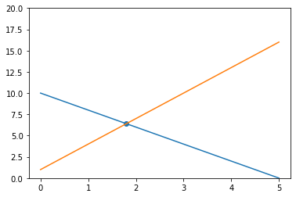

# Sympy


<div markdown="1" class="cell code_cell">
<div class="input_area" markdown="1">
```python
# HIDDEN
from datascience import *
import numpy as np
from sympy import *
init_printing()
import matplotlib.pyplot as plt
%matplotlib inline

```
</div>

</div>


## SymPy


Python has many tools, such as the [SymPy library](https://docs.sympy.org/latest/tutorial/index.html) that we can use for expressing and evaluating formulas and functions in economics. Since SymPy helps with symbolic math, we start out by create a symbol using `Symbol`, which we assign to a variable name. Then, we can use the symbols for constructing symbolic expressions.


<div markdown="1" class="cell code_cell">
<div class="input_area" markdown="1">
```python
# Run this cell
x = Symbol('x')
x

```
</div>

</div>


Now let's try using SymPy for creating a symbolic expression for some hypothetical supply and demand curves. Let's start out with an upward sloping supply curve, where $P_S$ is price and $Q_S$ is quantity supplied.


<div markdown="1" class="cell code_cell">
<div class="input_area" markdown="1">
```python
Q_S = Symbol('Q_S')
P_S = 2 * Q_S - 4
P_S

```
</div>

<div class="output_wrapper" markdown="1">
<div class="output_subarea" markdown="1">


$$2 Q_{S} - 4$$


</div>
</div>
</div>


Now, use the same symbols $P_D$ and $Q_D$ to create an expression for a downward sloping Demand curve.


<div markdown="1" class="cell code_cell">
<div class="input_area" markdown="1">
```python
Q_D = Symbol('Q_D')
P_D = 2 - Q_D
P_D

```
</div>

<div class="output_wrapper" markdown="1">
<div class="output_subarea" markdown="1">


$$- Q_{D} + 2$$


</div>
</div>
</div>


Given the supply and demand curve, we set the two equations equal to each other and solve for the equilibrium price and equilibrium quantity. Using SymPy, we call solve, which takes in the equation as the first argument followed by the variable we are solving for. This is a custom function, which will be provided in the notebooks for you.


<div markdown="1" class="cell code_cell">
<div class="input_area" markdown="1">
```python
solve(P_S, Q_S)

```
</div>

<div class="output_wrapper" markdown="1">
<div class="output_subarea" markdown="1">


$$\left [ 2\right ]$$


</div>
</div>
</div>


<div markdown="1" class="cell code_cell">
<div class="input_area" markdown="1">
```python
solve(P_S, P_D)

```
</div>

<div class="output_wrapper" markdown="1">
<div class="output_subarea" markdown="1">


$$\left [ 0\right ]$$


</div>
</div>
</div>


The equilibrium price and quantity are 0 and 2, respectively. 


Let's suppose our demand function is $Quantity_{D}=-2 * Price_{D} + 10$. Using SymPy, this would be


<div markdown="1" class="cell code_cell">
<div class="input_area" markdown="1">
```python
q = Symbol("q")
demand = -2*q + 10
demand

```
</div>

<div class="output_wrapper" markdown="1">
<div class="output_subarea" markdown="1">


$$- 2 q + 10$$


</div>
</div>
</div>


Suppose we have a supply function $Price_{S}=3 * Quantity_{S} + 1$. Using SymPy, this would be


<div markdown="1" class="cell code_cell">
<div class="input_area" markdown="1">
```python
supply = 3*q + 1
supply

```
</div>

<div class="output_wrapper" markdown="1">
<div class="output_subarea" markdown="1">


$$3 q + 1$$


</div>
</div>
</div>


We will now try to find the market equilibrium. The market equilibrium is the price at which the quantity supplied and quantity demanded of a good or service is equal to each other. Hence, it is the point at which the demand and supply curves intersect. In the beginning of the workbook, we defined a function called solve which finds the x-value of a demand and supply curve's intersection. This point will be referred to as the equilibrium quantity, also known as Q*. 


<div markdown="1" class="cell code_cell">
<div class="input_area" markdown="1">
```python
def plot_equation(equation, price_start, price_end, label=None):
    plot_prices = [price_start, price_end]
    plot_quantities = [equation.subs(list(equation.free_symbols)[0], c) for c in plot_prices]
    plt.plot(plot_prices, plot_quantities, label=label)
    
def plot_intercept(eq1, eq2):
    ex = solve(eq1-eq2)[0]
    why = eq1.subs(list(eq1.free_symbols)[0], ex)
    plt.scatter([ex], [why])
    return (ex, why)
    
plot_equation(demand, 0, 5)
plot_equation(supply, 0, 5)
plt.ylim(0,20)
plot_intercept(supply, demand)

```
</div>

<div class="output_wrapper" markdown="1">
<div class="output_subarea" markdown="1">


$$\left ( \frac{9}{5}, \quad \frac{32}{5}\right )$$


</div>
</div>
<div class="output_wrapper" markdown="1">
<div class="output_subarea" markdown="1">

{:.output_png}


</div>
</div>
</div>


Congrats! You finished the Lab 1! 


---

## Resources

[Prob 140](https://prob140.org), [opentextbc.ca](https://opentextbc.ca)


 

