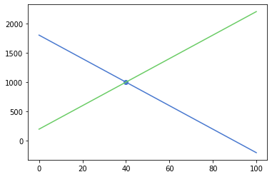
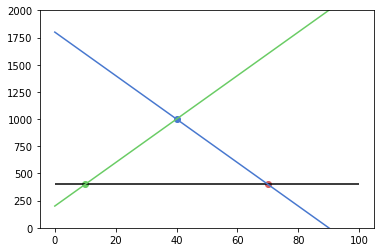
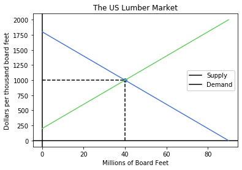

<table style="width: 100%;">
    <tr style="background-color: transparent;"><td>
        
    </td><td>
        <p style="text-align: right; font-size: 12pt;"><strong>Economic Models</strong>, Fall 2019<br>
            Dr. Eric Van Dusen</p></td></tr>
</table>


## Lab 4 - Supply Demand Trade
### with welfare effects and interactive sliders


by Eric Van Dusen and Chris Pyles 


In this lab we will seek to combine many of the elements that we have learned in the first 4 labs, to add the equilibrium and welfare effects of a market in equilibrium and one out of equilibrium due to tariffs.   


<div markdown="1" class="cell code_cell">
<div class="input_area" markdown="1">
```python
from utils import *
import numpy as np
import sympy
import matplotlib.pyplot as plt
solve = lambda x,y: sympy.solve(x-y)[0] if len(sympy.solve(x-y))==1 else "Not Single Solution"
import matplotlib.pyplot as plt
plt.style.use("seaborn-muted")
%matplotlib inline
from ipywidgets import interact, interactive, fixed, interact_manual
import ipywidgets as widgets
from IPython.display import display
import warnings
warnings.filterwarnings('ignore')

```
</div>

</div>


### Section 1 - A trade model
To motivate this example we are going to follow along an example from the textbook Principles of Microeconomics by Dr. Emma Hutchinson, University of Victoria.  Specifically an example about US Lumber tariffs.  


https://pressbooks.bccampus.ca/uvicecon103/chapter/4-7-tariffs/

Specifically we will work to recreate the following graph:


<div style="width:image width px; font-size:80%; text-align:center;"> </div>


### 1.1 Simple Domestic Model

As in previous labs we will begin in `sympy` by declaring variables and equations


<div markdown="1" class="cell code_cell">
<div class="input_area" markdown="1">
```python
Q = sympy.Symbol("Q")

```
</div>

</div>


<div markdown="1" class="cell code_cell">
<div class="input_area" markdown="1">
```python
supply = 200 + 20*Q
supply

```
</div>

<div class="output_wrapper" markdown="1">
<div class="output_subarea" markdown="1">


$\displaystyle 20 Q + 200$


</div>
</div>
</div>


<div markdown="1" class="cell code_cell">
<div class="input_area" markdown="1">
```python
demand = 1800 - 20*Q
demand

```
</div>

<div class="output_wrapper" markdown="1">
<div class="output_subarea" markdown="1">


$\displaystyle 1800 - 20 Q$


</div>
</div>
</div>


Lets Solve for the domestic equilibrium Quantity (if the US was closed to trade "autarky") ( in millions of board feet) by setting $Q_d=Q_d$


<div markdown="1" class="cell code_cell">
<div class="input_area" markdown="1">
```python
Q_star = solve(demand, supply) # our version of solve is simplified for single solution systems
Q_star

```
</div>

<div class="output_wrapper" markdown="1">
<div class="output_subarea" markdown="1">


$\displaystyle 40$


</div>
</div>
</div>


<div markdown="1" class="cell code_cell">
<div class="input_area" markdown="1">
```python
# or alternatively
print("The domestic equilibrium quantity of lumber sold is", Q_star, "million board feet")

```
</div>

<div class="output_wrapper" markdown="1">
<div class="output_subarea" markdown="1">
{:.output_stream}
```
The domestic equilibrium quantity of lumber sold is 40 million board feet
```
</div>
</div>
</div>


Lets Solve for the domestic equilibrium Price  ( in Dollars per thousand board feet) by substituting  $Q^* $ into the demand equation)


<div markdown="1" class="cell code_cell">
<div class="input_area" markdown="1">
```python
P_star_d = demand.subs(Q, Q_star)
P_star_d

```
</div>

<div class="output_wrapper" markdown="1">
<div class="output_subarea" markdown="1">


$\displaystyle 1000$


</div>
</div>
</div>


<div markdown="1" class="cell code_cell">
<div class="input_area" markdown="1">
```python
# or alternatively
print("The domestic equilibrium price of lumber sold is", P_star_d, "$ per bF")

```
</div>

<div class="output_wrapper" markdown="1">
<div class="output_subarea" markdown="1">
{:.output_stream}
```
The domestic equilibrium price of lumber sold is 1000 $ per bF
```
</div>
</div>
</div>


<div markdown="1" class="cell code_cell">
<div class="input_area" markdown="1">
```python
P_star_s = demand.subs(Q, Q_star)
P_star_s

```
</div>

<div class="output_wrapper" markdown="1">
<div class="output_subarea" markdown="1">


$\displaystyle 1000$


</div>
</div>
</div>


### 1.2 World Price
Now let's introduce international trade and a world price for Lumber

( Suppose a friendly neighboring country had lots of forests and lumber to sell)


<div markdown="1" class="cell code_cell">
<div class="input_area" markdown="1">
```python
World_Price = 400
World_Price

```
</div>

<div class="output_wrapper" markdown="1">
<div class="output_subarea" markdown="1">


{:.output_data_text}
```
400
```


</div>
</div>
</div>


How much would the US market Demand at this lower World Price?


<div markdown="1" class="cell code_cell">
<div class="input_area" markdown="1">
```python
QD_FreeTrade = solve(demand, World_Price)
QD_FreeTrade
print("The quantity of lumber demanded at the World Price is", QD_FreeTrade, "million board feet")

```
</div>

<div class="output_wrapper" markdown="1">
<div class="output_subarea" markdown="1">
{:.output_stream}
```
The quantity of lumber demanded at the World Price is 70 million board feet
```
</div>
</div>
</div>


<div markdown="1" class="cell code_cell">
<div class="input_area" markdown="1">
```python
QS_FreeTrade = solve(supply, World_Price)
print("The quantity of lumber sold by domestic producers at the World Price is", QS_FreeTrade, "million board feet")

```
</div>

<div class="output_wrapper" markdown="1">
<div class="output_subarea" markdown="1">
{:.output_stream}
```
The quantity of lumber sold by domestic producers at the World Price is 10 million board feet
```
</div>
</div>
</div>


<div markdown="1" class="cell code_cell">
<div class="input_area" markdown="1">
```python
Imports_FreeTrade = QD_FreeTrade - QS_FreeTrade
print("The quantity of lumber imported at the World Price is", Imports_FreeTrade, "million board feet")

```
</div>

<div class="output_wrapper" markdown="1">
<div class="output_subarea" markdown="1">
{:.output_stream}
```
The quantity of lumber imported at the World Price is 60 million board feet
```
</div>
</div>
</div>


<div style="width:image width px; font-size:80%; text-align:center;"></div>


### 1.2 Tariffs
Now let's introduce a US tariff on Lumber

( Suppose a president wanted to protect domestic producers of lumber and "save logging jobs")


<div markdown="1" class="cell code_cell">
<div class="input_area" markdown="1">
```python
Tariff = 400
Tariff

```
</div>

<div class="output_wrapper" markdown="1">
<div class="output_subarea" markdown="1">


{:.output_data_text}
```
400
```


</div>
</div>
</div>


<div markdown="1" class="cell code_cell">
<div class="input_area" markdown="1">
```python
Protected_Price = World_Price + Tariff
Protected_Price

```
</div>

<div class="output_wrapper" markdown="1">
<div class="output_subarea" markdown="1">


{:.output_data_text}
```
800
```


</div>
</div>
</div>


<div markdown="1" class="cell code_cell">
<div class="input_area" markdown="1">
```python
#alternatively
print("The US tariff on imported lumber is", Tariff, "$ per bF")
print("US Consumers will now pay", Protected_Price, "$ per bF")

```
</div>

<div class="output_wrapper" markdown="1">
<div class="output_subarea" markdown="1">
{:.output_stream}
```
The US tariff on imported lumber is 400 $ per bF
US Consumers will now pay 800 $ per bF
```
</div>
</div>
</div>


<div markdown="1" class="cell code_cell">
<div class="input_area" markdown="1">
```python
QD_Protected = solve(demand, Protected_Price)
print("The quantity of lumber demanded at the price with Tariffs is", QD_Protected, "million board feet")

```
</div>

<div class="output_wrapper" markdown="1">
<div class="output_subarea" markdown="1">
{:.output_stream}
```
The quantity of lumber demanded at the price with Tariffs is 50 million board feet
```
</div>
</div>
</div>


<div markdown="1" class="cell code_cell">
<div class="input_area" markdown="1">
```python
QS_Protected = solve(supply, Protected_Price)
print("The quantity of lumber sold by domestic producers at the price with Tariffs is", QS_Protected, "million board feet")

```
</div>

<div class="output_wrapper" markdown="1">
<div class="output_subarea" markdown="1">
{:.output_stream}
```
The quantity of lumber sold by domestic producers at the price with Tariffs is 30 million board feet
```
</div>
</div>
</div>


<div markdown="1" class="cell code_cell">
<div class="input_area" markdown="1">
```python
Imports_Protected = QD_Protected - QS_Protected
Imports_Protected

```
</div>

<div class="output_wrapper" markdown="1">
<div class="output_subarea" markdown="1">


$\displaystyle 20$


</div>
</div>
</div>


<div markdown="1" class="cell code_cell">
<div class="input_area" markdown="1">
```python
Change_in_Imports = Imports_FreeTrade - Imports_Protected
Change_in_Imports

```
</div>

<div class="output_wrapper" markdown="1">
<div class="output_subarea" markdown="1">


$\displaystyle 40$


</div>
</div>
</div>


<div markdown="1" class="cell code_cell">
<div class="input_area" markdown="1">
```python
# Alternatively
print("The US will now import just" ,Imports_Protected, "down from", Imports_FreeTrade)
print("This constitutes a reduction in imports of ", Change_in_Imports, "million bF")

```
</div>

<div class="output_wrapper" markdown="1">
<div class="output_subarea" markdown="1">
{:.output_stream}
```
The US will now import just 20 down from 60
This constitutes a reduction in imports of  40 million bF
```
</div>
</div>
</div>


### 2.1 Graphical Solutions
Now let's work on graphing this same solution
In the following section we will define functions to solve these equations


<div markdown="1" class="cell code_cell">
<div class="input_area" markdown="1">
```python
def plot_equation(equation, price_start, price_end, label=None):
    plot_prices = [price_start, price_end]
    plot_quantities = [equation.subs(list(equation.free_symbols)[0], c) for c in plot_prices]
    plt.plot(plot_prices, plot_quantities, label=label)
    
def plot_intercept(eq1, eq2):
    ex = sympy.solve(eq1-eq2)[0]
    why = eq1.subs(list(eq1.free_symbols)[0], ex)
    plt.scatter([ex], [why])
    return (ex, why)

def plot_intercept_tradeprice (eq, price):
    ex = solve(eq, price)
    why = price
    plt.scatter([ex], [why])
    return (ex, why)


```
</div>

</div>


<div markdown="1" class="cell code_cell">
<div class="input_area" markdown="1">
```python
# Simple Equilibrium Graphed
# Here are the basic elements of the Graph
#Demand Curve    
plot_equation(demand, 0, 100)
#Supply Curve
plot_equation(supply, 0, 100)
#Domestic Equilibrium Point
plot_intercept(supply, demand)

```
</div>

<div class="output_wrapper" markdown="1">
<div class="output_subarea" markdown="1">


{:.output_data_text}
```
(40, 1000)
```


</div>
</div>
<div class="output_wrapper" markdown="1">
<div class="output_subarea" markdown="1">

{:.output_png}


</div>
</div>
</div>


<div markdown="1" class="cell code_cell">
<div class="input_area" markdown="1">
```python

# Equilibrium with World Price and Protected Price

plot_equation(demand, 0, 100)
plot_equation(supply, 0, 100)
plt.hlines(World_Price, 0,100)
plt.ylim(0,2000)
plot_intercept(supply, demand)
plot_intercept_tradeprice(supply,World_Price)
plot_intercept_tradeprice(demand,World_Price)

```
</div>

<div class="output_wrapper" markdown="1">
<div class="output_subarea" markdown="1">


{:.output_data_text}
```
(70, 400)
```


</div>
</div>
<div class="output_wrapper" markdown="1">
<div class="output_subarea" markdown="1">

{:.output_png}


</div>
</div>
</div>


### 2.2 Labeling the Graphs

These graphs in 2.1 don't quite have enough information in them, lets compare to the textbook table above and add in the information that is missing


<div markdown="1" class="cell code_cell">
<div class="input_area" markdown="1">
```python
# In order to label the axes - lets make it a combination of plots and axes 
fig, ax = plt.subplots()
# Setting Axes at P=0, Q=0
ax.axhline(y=0, color='k')
ax.axvline(x=0, color='k')

#Demand Curve    
plot_equation(demand, 0, 90)
#Supply Curve
plot_equation(supply, 0, 90)
#Domestic Equilibrium Point
plot_intercept(supply, demand)

# Add a title to the Plot
plt.title("The US Lumber Market");
# Label the axes
plt.xlabel('Millions of Board Feet')
plt.ylabel('Dollars per thousand board feet')
#Legend for the Lines
plt.legend(["Supply", "Demand"], loc=5, framealpha=1)
#Dashed Lines at P_star, Q_star
plt.hlines(P_star_d, 0,Q_star,linestyle="--")
plt.vlines(Q_star, 0,P_star_d,linestyle="--")


```
</div>

<div class="output_wrapper" markdown="1">
<div class="output_subarea" markdown="1">


{:.output_data_text}
```
<matplotlib.collections.LineCollection at 0x7f7714d35128>
```


</div>
</div>
<div class="output_wrapper" markdown="1">
<div class="output_subarea" markdown="1">

{:.output_png}


</div>
</div>
</div>


## Excercise 1 - Formatting

Can you format up the following table with title, axes, legends?


<div markdown="1" class="cell code_cell">
<div class="input_area" markdown="1">
```python
# Equilibrium with World Price and Protected Price

plot_equation(demand, 0, 100)
plot_equation(supply, 0, 100)
plt.hlines(World_Price, 0,100)
plt.ylim(0,2000)
plot_intercept(supply, demand)
plot_intercept_tradeprice(supply,World_Price)
plot_intercept_tradeprice(demand,World_Price)

```
</div>

<div class="output_wrapper" markdown="1">
<div class="output_subarea" markdown="1">


{:.output_data_text}
```
(70, 400)
```


</div>
</div>
<div class="output_wrapper" markdown="1">
<div class="output_subarea" markdown="1">

{:.output_png}


</div>
</div>
</div>


## Section 3 - adding in an adjustable Tariff


<div markdown="1" class="cell code_cell">
<div class="input_area" markdown="1">
```python
Tariff = widgets.IntSlider(value=400, min=0, max=1000, step=50)
plot = lambda Tariff: plot_1(20, 200, -20, 1800, 400, Tariff)
widgets.interact(plot, Tariff=Tariff);

```
</div>

<div class="output_wrapper" markdown="1">
<div class="output_subarea" markdown="1">
{:.output_data_text}
```
interactive(children=(IntSlider(value=400, description='Tariff', max=1000, step=50), Output()), _dom_classes=(…
```

</div>
</div>
</div>


 

