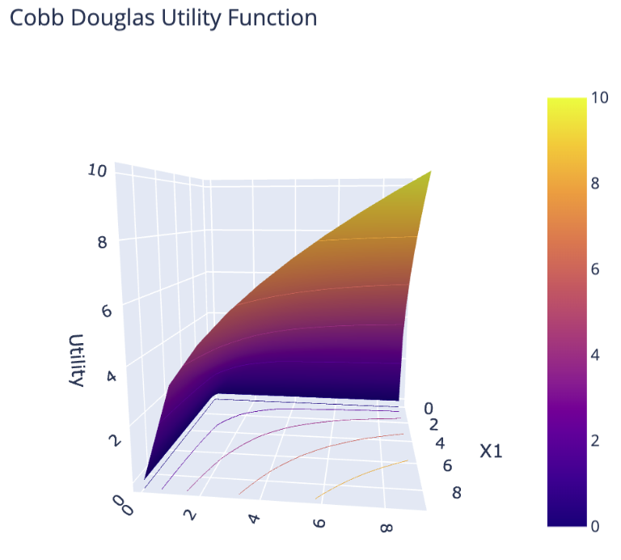
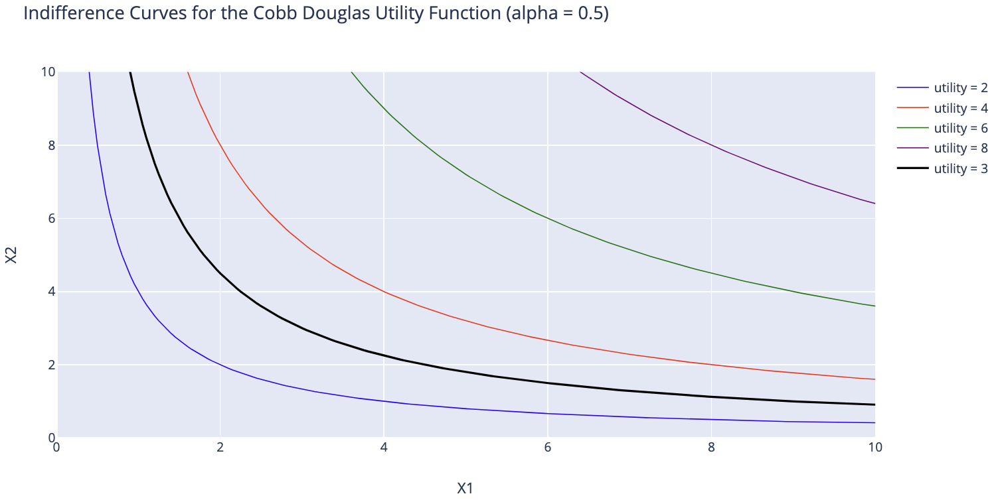
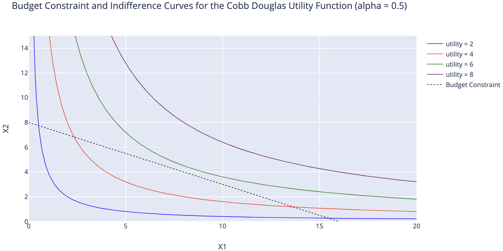
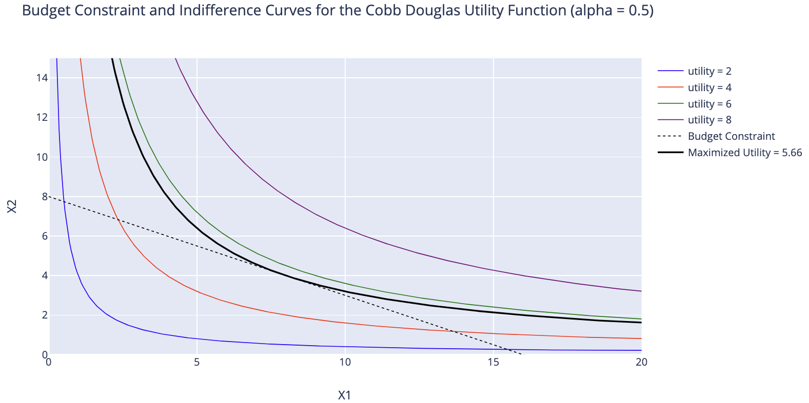
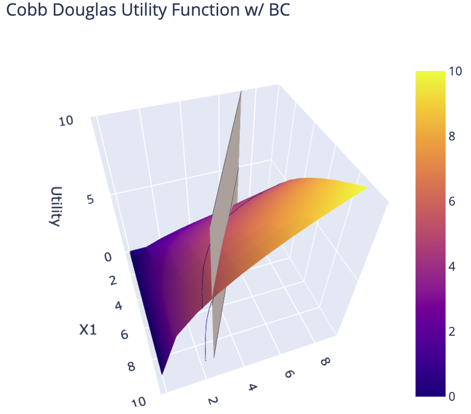

# Utility

### What is Utility?

When we consume a good, we assume that the good will have some impact on our total utility. Utility is a fundamental measure that helps economists model how consumers make decisions. An assumed rule in economics is that consumers will always act rationally, which translates to the assumption that consumers will always attempt to maximize their own utility. 

It is important to note that utility doesn't have specified units and even the face value of utility doesn't have any meaning. *What does an apple providing 5 utility units even mean?* What is valuable, however, is that utility can be compared: if an apple provides 5 utility units and an orange provides 3 utility units, then we prefer apples to oranges.

As a very simple example, say Anne has 6 dollars and she can choose to buy any combination of goods A and B. If good A costs 2 dollars and provides 5 utility units per unit of A consumed, while good B costs 3 dollars and provides 6 utility units per unit of B consumed, then Anne will buy 3 units of good A, since that maximizes her utility. 

In economics, however, our models are a little more complex than that. Typically, utility is the product of the consumption of many goods; typically having a lot of one good but not another does not provide much utility. In addition, consumption of one good faces diminishing marginal returns, i.e. holding all things equal, the consumption of one additional unit of a good will provide less utility than the utility received from the previous unit. Intuitively, imagine Bob is very hungry and decides to eat slices of pizza. The first slice of pizza will bring Bob the most utility, but the 8th slice will be much less satisfying to eat.

### Utility Functions
A consumer's utility is determined by the amount of consumption from all the goods they consume. Typically, utility functions are multivariate: they take in multiple inputs (which represent the different amounts of consumption for each good, which we call a consumption bundle), and output 1 value, the utility. Today, we'll only look at the case where consumers can only choose between 2 goods $x_1$ and $x_2$. Hence, a utility function can be represented by: $u(x_1,x_2)$. 

With that in mind, let's start graphing some utility functions!

## Cobb Douglas Utility Function
Consider the following utility function across $x_1$ and $x_2$:
$$u(x_1, x_2)=x_1^{\alpha}x_2^{1-\alpha}\quad\textrm{where $0<\alpha<1$}$$

This is known as the Cobb Douglas Utility Function. To visualize this function, we'll need a 3D plot. 

### Examining the Utility Function

There are 2 rules that utility functions generally follow: 
- Non-negative marginal utility: the consumption of a good will not decrease the utility. Economists generally assume that 'more is better'. If the consumption of a good decreased utility, then we would consume less of a good. 
- Diminishing marginal returns: all else equal, as consumption increases the marginal utility derived from each additional unit declines.

#### Non-negative Marginal Utility
Say we are currently consuming 2 units of $x_1$ and $x_2$ each with $\alpha = \frac{1}{2}$, providing $u(2,2)=2^{0.5}2^{0.5}=2$ utility units. One additional unit of $x_1$ will provide me a higher point of utility: we can verify this result both graphically and numerically: $u(3,2)=3^{0.5}2^{0.5}\approx2.45$. Indeed, consuming one more unit of a good should increase our utility!

#### Marginal Utility and the Law of Diminishing Returns
Now let's check for the second result: diminishing marginal returns. From above, we know that holding the consumption of $x_2$ constant at 2, going from 2 to 3 units of $x_1$ increases our utility by $2.45-2=0.45$. Going from 3 to 4 units of $x_1$ brings our utility to $u(4,2)=4^{0.5}2^{0.5}\approx 2.83$, an increase of $2.83-2.45=0.38$ utility units.

Using calculus, we can more formally define the marginal utility of a good. Since marginal utility is the change in utility that one additional unit of consumption provides (holding all others constant), the marginal utility with respect to $x_1$ is its partial derivative: $\frac{\partial u}{\partial x_1}$. In our case:
$$\textrm{Marginal Utility of $x_1$:}\quad\frac{\partial u}{\partial x_1} = \frac{1}{2}x_1^{-0.5}x_2^{0.5}$$
$$\textrm{Marginal Utility of $x_2$:}\quad\frac{\partial u}{\partial x_2} = \frac{1}{2}x_1^{0.5}x_2^{-0.5}$$

Or more generally, 
$$\textrm{Marginal Utility of $x_1$:}\quad\frac{\partial u}{\partial x_1} = \alpha x_1^{\alpha-1}x_2^{1-\alpha}$$
$$\textrm{Marginal Utility of $x_2$:}\quad\frac{\partial u}{\partial x_2} = (1-\alpha) x_1^{\alpha}x_2^{-\alpha}$$

With marginal utility defined, note that both conditions can be explained using the marginal utility function $\frac{\partial u}{\partial x}$: 
- Non-negative marginal utility: $\frac{\partial u}{\partial x} \geq 0 $
- Diminishing marginal returns: $\frac{\partial^2 u}{\partial x^2} < 0 $

### Indifference Curves
Although the utility function above in 3D is cool, you'll typically find utility graphs to be in 2D with $x_1$ and $x_2$ as the axis (eliminating the utility axis). 

To represent utility levels, we plot a set of indifference curves on the 2D graph. An indifference curve satisfies the property in which **any point on the curve has the exact same amount of utility**, so that consumers are _indifferent_ to any point on the curve. In our 3D plot, any point on the indifference curve has the exact same height, which represents the value of utility. If you're familar with contour plots, you can also think of indifference curves as following the same idea. 

# Budget Constraints
_For the rest of the page, we will assume that $\alpha = 0.5$, i.e. the utility function is: $u(x_1, x_2) = x_1^{0.5}x_2^{0.5}$._

Now we introduce the concept of money into our model. Consumers face a budget constraint when choosing to maximize their utility. Given an income $M$ and prices $p_1$ for good $x_1$ and $p_2$ for good $x_2$, the consumer can at most spend up to $M$ for both goods:
$$M \geq p_1x_1 + p_2x_2$$

Since goods will always bring non-negative utility, consumers will try to consume as many goods as they can. Hence, we can rewrite the budget constraint as an equality instead (since if they have more income leftover, they will use it to buy more goods).
$$M = p_1x_1 + p_2x_2$$

This means that any bundle of goods $(x_1,x_2)$ that consumers choose to consume will adhere to the equality above. What does this mean on our graph? Let's examine the indifference curve plots, assuming that $M = 32$, and $p_1 =2$ and $p_2 = 4$. 

The budget constraint is like a possibilities curve: moving up or down the constraint means gaining more of one good while sacrificing the other.

Let's take a look at what this budget constraint means. Because of the budget constraint, any bundle of goods $(x_1,x_2)$ that consumers ultimately decide to consume will lie on the budget constraint line. Adhering to this constraint where $M=32, p_1 = 2, p_2 = 4$, we can see that consumers will be able to achieve 2 units of utility, and can also achieve 4 units of utility. But what is the maximum amount of utility that consumers can achieve? 

Notice an interesting property about indifference curves: **the utility level of the indifference curves gets larger as we move up and to the right.**

Hence, the maximizing amount of utility in this budget constraint is the rightmost indifference curve that still touches the budget constraint line. In fact, it'll only 'touch' (and not intersect) the budget constraint and be tangential to it. 

Notice that as the price of one good increases, the indifference curve that represents the maximum attainable utility shifts towards the left (i.e. the max utility decreases). Intuitively, this makes sense. As the price of one good increases, consumers have to make adjustments to their consumption bundles and buy less of one, or both, goods. Hence, their maximum utility will decrease.

Let's revisualize the budget constraint in 3D where $M=32, p_1=2, p_2=4$. Here, any point along the curve in which the 2 planes intersect represents an amount of utility in which the budget constraint holds true (i.e. where we've spent all our income). The utility maximizing quantity is a point on this intersecting curve at which the utility level is the highest.

 

